# Tic Tac Toe Game

    <!--     You can add your logo in the _src_ below -->
    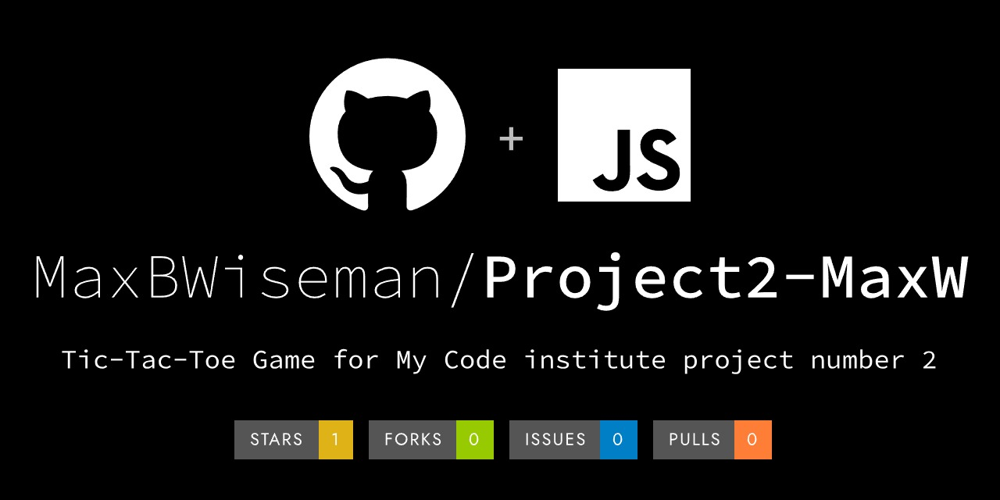

This is a simple Tic Tac Toe game implemented in JavaScript, HTML, and CSS. The game allows two
players to play against each other, and also provides an option to play against a computer opponent.

## Features

- Player vs Player mode
- Player vs Computer mode
- Score tracking
- Game reset functionality
- Option to toggle computer opponent on and off
- Custom player name

## How to Play

1. Open the game in your web browser.
2. If you want to play against the computer, click the "AI Opponent" button to turn it on.
3. Click on the cells of the game board to make your move.
4. The game will automatically detect when a player has won or when the game is a draw.
5. The scores of the players are displayed above the game board.
6. To start a new game, click the "New Game" button.
7. To reset the scores, click the "Reset Scores" button.

## Javascript Code Overview

1. Winning Condition Check: The code checks if there's a winning combination on the game board. If a player has won,
it updates the message text, increments the player's score, updates the score display, and sets gameActive to false.

2. Draw Condition Check: If there are no empty cells left on the game board and no player has won, it declares the
game as a draw, updates the message text, and sets gameActive to false.

3. Player Change: If the game is still active and there's no winner or draw, it changes the current player.

4. Game Restart: The restartGame function resets the game board to an empty state, sets the current player to 'X',
and makes the game active again. It also updates the display to show that it's player X's turn.

5. Score Reset: The resetScores function resets the scores of both players to 0 and updates the score display.

6. Computer Move: The computerMove function is used when playing against the computer. It finds all the empty cells,
selects one at random, and makes a move there.

7. Player Names: The playerNames function updates the display with the names of the players.

8. AI Toggle: The code at the end toggles the AI opponent on and off when the corresponding button is clicked.
It changes the class of the button to reflect the current state.

## Gameboard Pictures
### The main title and AI switch button
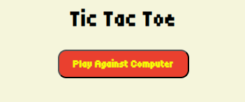
### Scoreboard
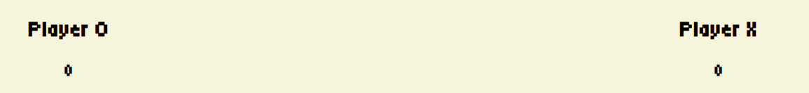
### That can be changed
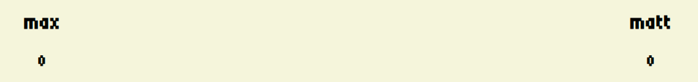
### Main playing area
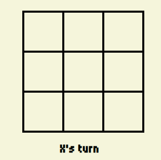
### New game and reset score buttons
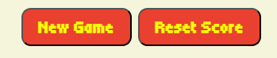
### Optional fields to enter player names
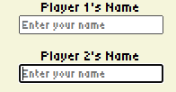
### Whole board together
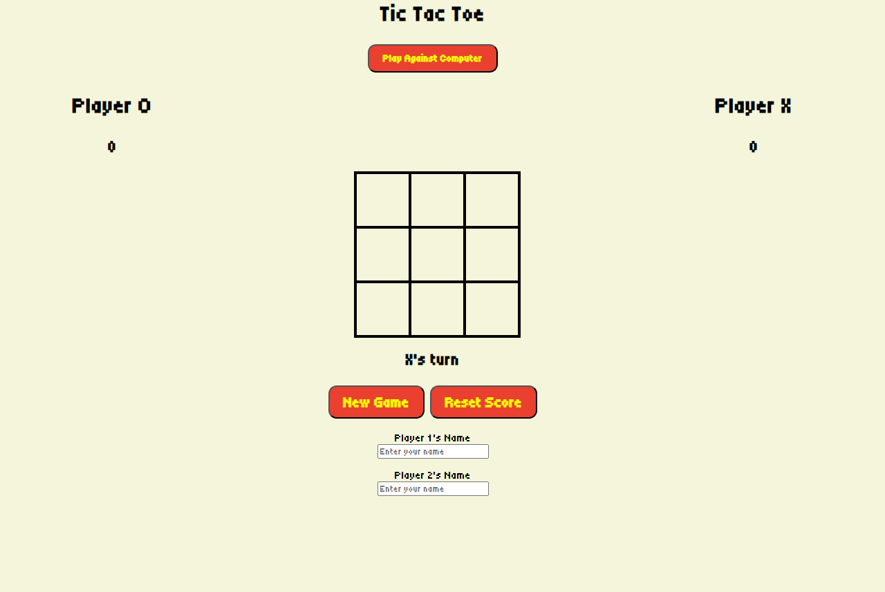
### Board being played
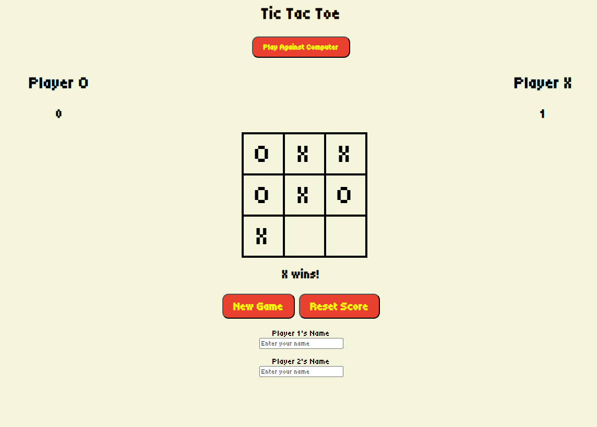

## Future Improvements

- Improve the AI for the computer opponent to make it more challenging.
- Add animations for winning and losing.
- Add the ability to choose which player goes first.

## A look at some of the code within

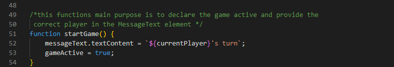

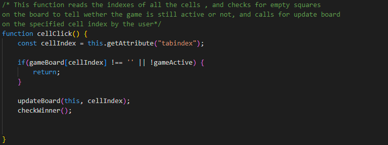

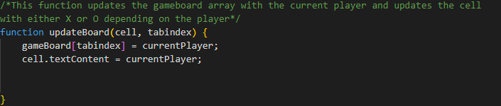

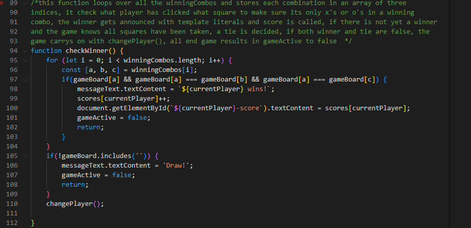

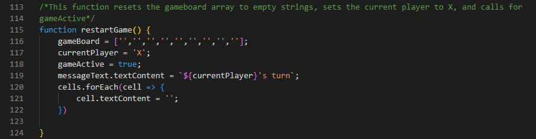

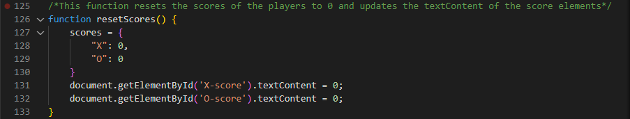

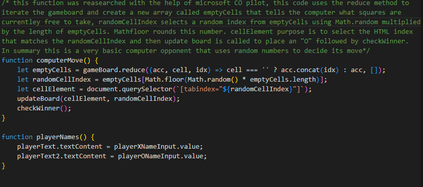

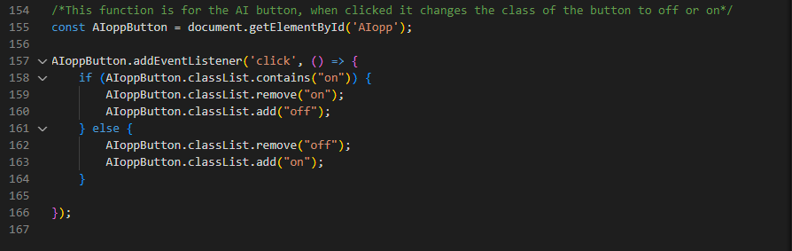

# Testing

### Testing on this project was mainly done manually by myself

## Testing game
| Test |Outcome  |
|--|--|
|AI oppenent| Pass |
|Reset score and New game| Pass|
|Custom names| Pass|
|Gameboard| Pass|
|Winning combos | Pass|
|Draw |Pass|

## Testing for responsiveness
| Test |Outcome  |
|--|--|
|Home pagedisplays correctly on screens larger than 950px|Pass |
|Home pagedisplays correctly on screens smaller than 950px |Pass  

## User testing

### I let my Mum have a go at playing and found that - 

| Test | Result |
|--|--|
|Upon arrival to website AI oppenent was found and used| 100%|
|Custom name was used |100%  |
|AI opponent was able to win| 100%|

## Responsive testing

### Personally tested

| Test | Result |
|--|--|
|Issues Reported| None|

## Lighthouse Report

My lighthouse report is only slightly let down by color contrast

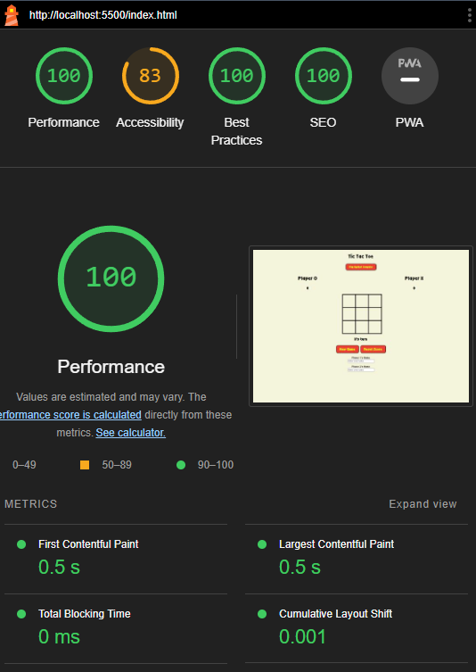

## Validation Proof

I have checked all validators and made sure there are no left over mistakes

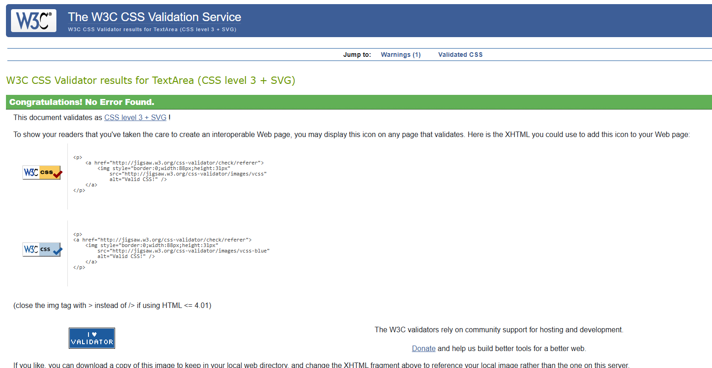

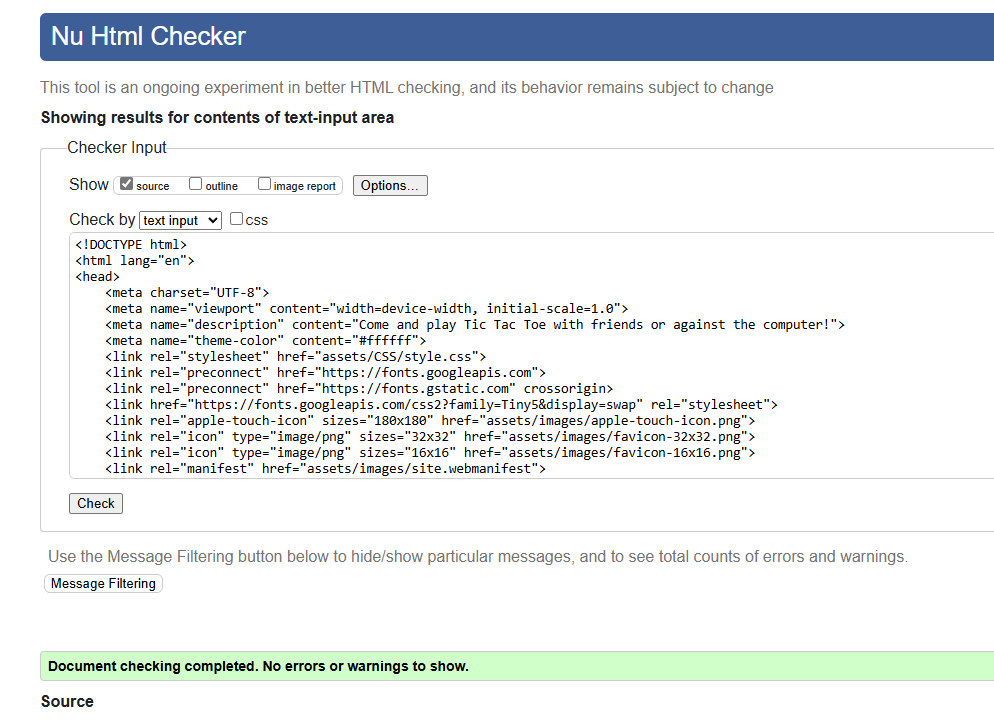

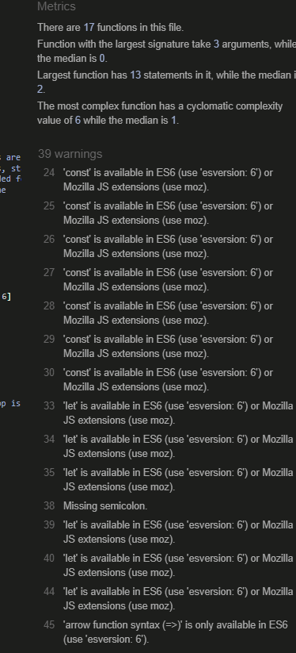

## Bugs

- There was a bug where the computer opponent would place its mark instantly after the players choice,
this was confusing for the user, so i added a small delay to make it clearer who is what player on the board.

## Deployment

- This site was deployed to GitHub Pages

- In the repository navigate to the setting tab

- From the source section drop down menu select the master branch

- Once the master branch has been selected, the page provided the link to the completed website

= https://maxbwiseman.github.io/Project2-MaxW/

Or click the link above!

### If you wish to download as a zip file

- Navigate to the Code dropdown near the about section for the project

- Download Zip at the bottom of the drop down

- Find the download location and extract all from the zip file

- Open a editor like VS code

- Press Explorer and select "Open File"

- Navigate to the download location of the extracted zip file

- Click into the folder until the title is not showing as a file

- Open Folder in the bottom right

- Either use the "Live Server" Extension  by Ritwick Dey to easily start a server on the bottom right of the editor with "Go Live" button (Extension must be installed)

- Or boot a local server with python aslong as its installed on your machine  with - "python3 -m http.server" inside the terminal (ctrl-j)

### Github Fork

- You may fork the repository into your own with the "Fork" button on this projects github page

- Navigate to your repositorys and clicki on your fork of this project

- Navigate on the top bar to "Settings"

- Then to "Pages"

- Deploy from the latest branch (or an older one if desire)

- Press "Save", your pages link should show on the "Pages" tab in 3 minutes or less

## Responsiveness 

### My project was desinged with mobile first in mind, with the use of flexbox my project works on any screen.

### Mobile view
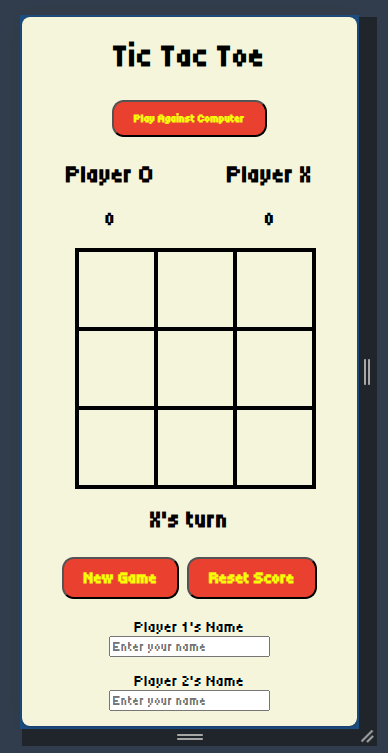
### Tablet view
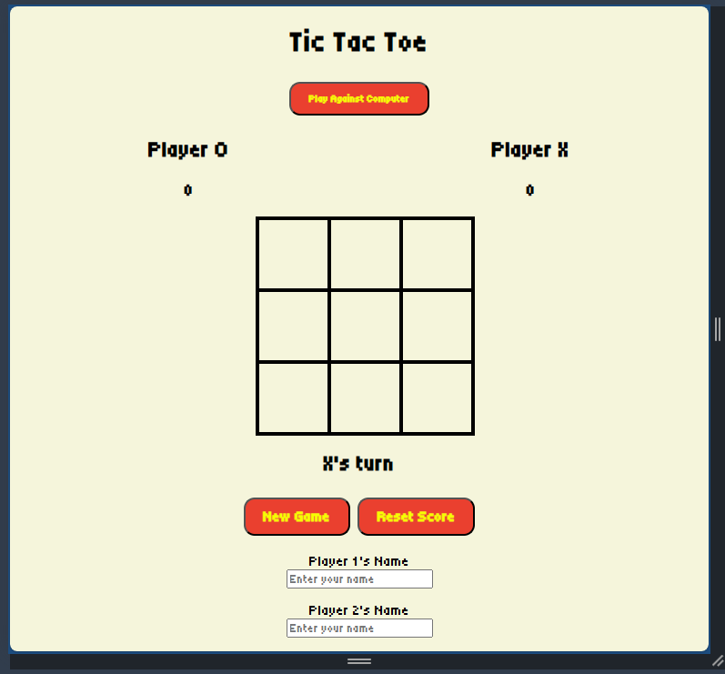
### Large screen view
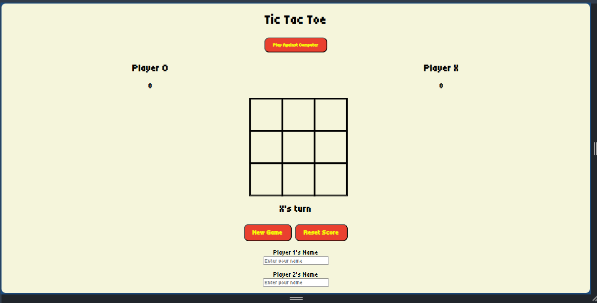

## Credits

### Credits to Microsoft Co Pilot for help with the computer opponent logic, this is what I have learned -
this function was reasearched with the help of microsoft CO pilot, this code uses the reduce method to
iterate the gameboard and create a new array called emptyCells that tells the computer what squares are
currentley free to take, randomCellIndex selects a random index from emptyCells using Math.random multiplied
by the length of emptyCells. Mathfloor rounds this number. cellElement purpose is to select the HTML index 
that matches the randomCellIndex and then update board is called to place an "O" followed by checkWinner.
In summary this is a very basic computer opponent that uses random numbers to decide its move

### Credits to "Bro Code" youtuber for having a video with helpfull insights on how to create a tictactoe game -

https://www.youtube.com/watch?v=AnmwHjpEhtA

### Fonts are credited to Google Fonts API -

https://fonts.googleapis.com/css2?family=Tiny5&display=swap

### No third party images were used in this project

Thanks for reading, Max Wiseman

